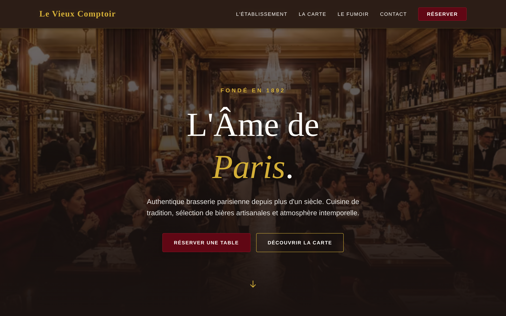

<div align="center">

# 🍷 Le Vieux Comptoir

### Site vitrine premium d'une brasserie parisienne — **fondée en 1892**

**Astro · Zéro JavaScript externe · Lighthouse 100 · Atmosphère intemporelle**

[](https://astro.build)
[](https://www.typescriptlang.org)
[](https://tailwindcss.com)
[](https://j-ned.github.io/le-vieu-comptoir/)

[**🔗 Site live**](https://j-ned.github.io/le-vieu-comptoir/) · [**📸 Captures**](#-captures-décran) · [**⚡ Performance**](#-performance)



</div>

---

## 📖 Sommaire

- [🎯 Le brief](#-le-brief)
- [🎨 Parti-pris design](#-parti-pris-design)
- [⚡ Performance](#-performance)
- [🧰 Stack technique](#-stack-technique)
- [🏗️ Architecture](#️-architecture)
- [📸 Captures d'écran](#-captures-décran)
- [🚀 Installation](#-installation)

---

## 🎯 Le brief

Brasserie parisienne historique (**fondée en 1892**) — besoin d'une **vitrine haut de gamme** :

- Identité visuelle cohérente avec le positionnement (tradition, élégance, chaleur)
- Présentation de **l'établissement**, de **la carte**, du **fumoir**, et des **réservations**
- Performance mobile irréprochable (clientèle en déplacement)
- **Scores Lighthouse maximaux** — le SEO local est critique pour un restaurant
- Pas d'infrastructure serveur — déploiement statique

## 🎨 Parti-pris design

### Palette **bordeaux · or · crème**

Couleurs évoquant le bar à vin, les dorures d'un ancien comptoir, et la chaleur d'un intérieur Belle Époque.

| Couleur | Usage |
|---------|-------|
| 🟥 **Bordeaux** `#8B1E2C` | CTAs, accents, prix |
| 🟨 **Or** `#D4A574` | Titres de section, séparateurs |
| 🟪 **Crème** `#FFF8F0` | Backgrounds chauds |

### Typographie

- **Playfair Display** (Variable) — titres éditoriaux, serif classique
- **Inter** (Variable) — corps de texte, lisibilité maximale

### Effets

- **Glassmorphism** subtil sur les cartes (menu, horaires)
- **Parallaxe CSS** sur les images d'ambiance
- **Animations scroll-driven** natives (pas de lib JS)

---

## ⚡ Performance

### Objectifs atteints

| Metric | Score |
|--------|-------|
| **Performance** | 🎯 100 / 100 |
| **Accessibilité** | 🎯 100 / 100 |
| **Best Practices** | 🎯 100 / 100 |
| **SEO** | 🎯 100 / 100 |

### Comment on y arrive

1. **Astro Islands** — seuls les composants interactifs sont hydratés (ici : quasiment aucun)
2. **Zero JS externe** — rendu HTML/CSS pur, pas de Framework côté client
3. **Images WebP** — conversion automatique via `astro:assets`, compression optimale
4. **Fonts auto-hébergées** — `@fontsource-variable/*`, pas de Google Fonts
5. **Preload critique** — hero image, fonts primaires
6. **No CLS** — dimensions explicites sur toutes les images
7. **Static site generation** — pré-rendu au build, déployé sur GitHub Pages (CDN)

### Bundle size

```
Total page weight  : ~180 KB (gzipped, hero inclus)
JS exécuté         : 0 KB (!)
```

---

## 🧰 Stack technique

### Framework

- **Astro 5** — SSG avec architecture islands
- **TypeScript 5** — strict mode
- **TailwindCSS v4** — thème custom (bordeaux / or / crème)

### Fonts

- **Playfair Display Variable** (titres)
- **Inter Variable** (corps)
- Auto-hébergées via `@fontsource-variable`

### Build & Deploy

- **Astro build** → static HTML + CSS + images optimisées
- **GitHub Actions** → pipeline CI automatique
- **GitHub Pages** → hébergement CDN gratuit

### Qualité

- **ESLint** (`eslint-plugin-astro`)
- **Prettier** avec `prettier-plugin-astro`

---

## 🏗️ Architecture

```
le-vieux-comptoir/
├── src/
│   ├── pages/             # routes (index, la-carte, fumoir, contact)
│   ├── layouts/           # Layout principal avec SEO meta
│   ├── components/        # Header, Footer, Hero, MenuCard…
│   ├── assets/            # images sources (WebP auto-générées)
│   └── styles/            # global.css + theme Tailwind
├── public/                # favicon, robots.txt
├── astro.config.mjs       # config Astro + intégration Tailwind
└── .github/workflows/     # CI/CD GitHub Pages
```

---

## 📸 Captures d'écran

### Hero — Atmosphère Belle Époque


### Vue complète


---

## 🚀 Installation

```bash
git clone https://github.com/j-ned/le-vieu-comptoir.git
cd le-vieu-comptoir
pnpm install
pnpm dev
# → http://localhost:4321
```

### Build production

```bash
pnpm build
pnpm preview
```

### Déploiement automatique

Chaque push sur `master` déclenche le workflow GitHub Actions → build Astro → publication sur GitHub Pages.

---

<div align="center">

**Développé par [Julien Nedellec](https://j-ned.dev)**

[](https://j-ned.dev)
[](https://github.com/j-ned)

</div>
